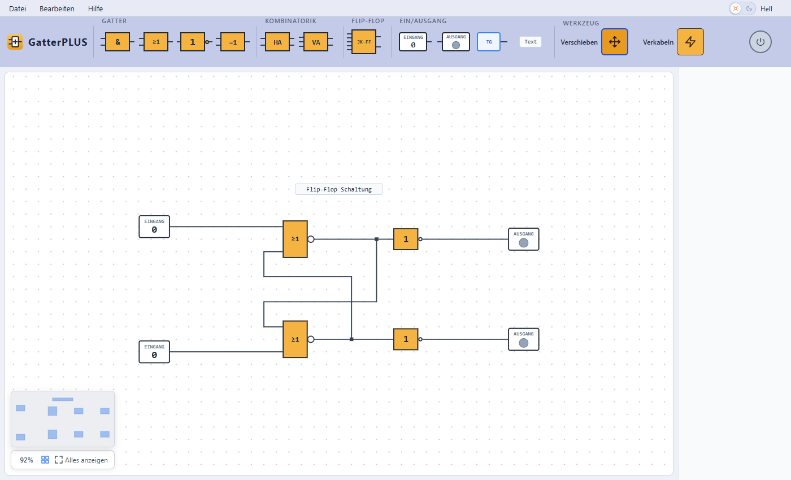

# GatterPLUS

Ein Logikschaltungs-Simulator im Browser – zum Lernen und Ausprobieren von
Digitaltechnik, inspiriert von LogikSim.

**▶ Live ausprobieren:** https://locksnatchneothehelp.github.io/GatterPLUS/



## Funktionen

- Bauteile per Drag & Drop: UND, ODER, NICHT, XOR, JK-Flipflop, Halb- und Volladdierer
- Ein-/Ausgabe: Schalter, LED, Taktgeber, Textfelder
- Leitungen selbst verlegen – mit Knickpunkten, Abzweigen und negierten Eingängen
- Live-Simulation der Signale
- Speichern/Laden als `.gatterplus.json`, Export als PNG
- Import von LogikSim-Dateien (`.sim`)
- Rückgängig/Wiederholen, Kopieren/Einfügen, Hell- und Dunkelmodus

## Lokal starten

Voraussetzung: [Node.js](https://nodejs.org) ab Version 18.

```bash
git clone https://github.com/locksnatchneothehelp/GatterPLUS.git
cd GatterPLUS/gatter-plus
npm install
npm start
```

Dann http://localhost:4200 öffnen. Tests: `npm test`.
Ausführliche Schritt-für-Schritt-Anleitung: [SETUP.md](SETUP.md).

## Technik

Angular 21 · TypeScript · SCSS · Vitest. Kein Backend – alles läuft im Browser.
Jeder Push auf `main` wird per GitHub Actions auf GitHub Pages veröffentlicht.

## Lizenz

[Apache 2.0](LICENSE)
